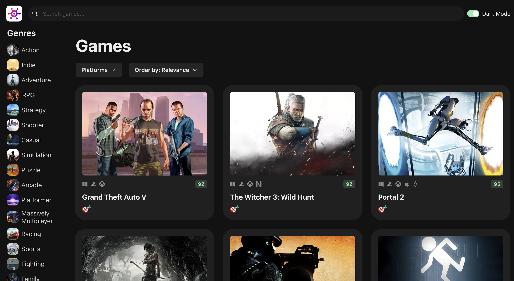

# Game hub application with ReactJS

### The application does the following:

-   execute HTTP requests to Rawg API with Axios,
-   allow users to filter by genres, platforms, search text or sort by default criteria,
-   implement infinite scroll, pagination and skeleton loading as well,
-   users are able to redirect to routers so that can view single game or list of multiple games as well 

## Live Demo

[View Live Version](https://game-hub-eight-wine.vercel.app/)

## How-to Guide

[Read the article on ...](link)

## Installation

-   Clone the project repository. Don't forget to star the repo 😉
-   Run `yarn install` to install its dependencies.
-   Start the development server by running `yarn run dev`

## Tools

-   [ReactJS](https://react.dev/)
-   [Chakra UI](https://chakra-ui.com/)
-   [Zustand](https://docs.pmnd.rs/zustand/getting-started/introduction)
-   [React Query](https://tanstack.com/query/latest/docs/react/overview)
-   [React Icons](https://react-icons.github.io/react-icons)
-   [Axios](https://axios-http.com/docs/intro)
-   [React Infinite Scroll Component](https://github.com/ankeetmaini/react-infinite-scroll-component)
